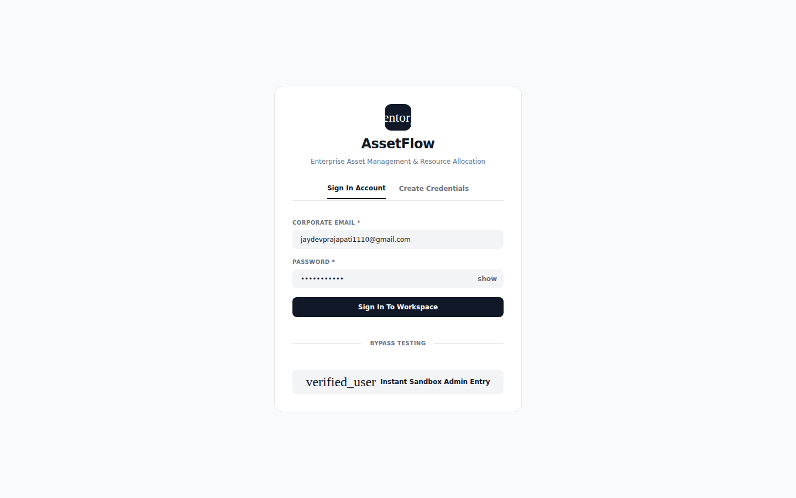
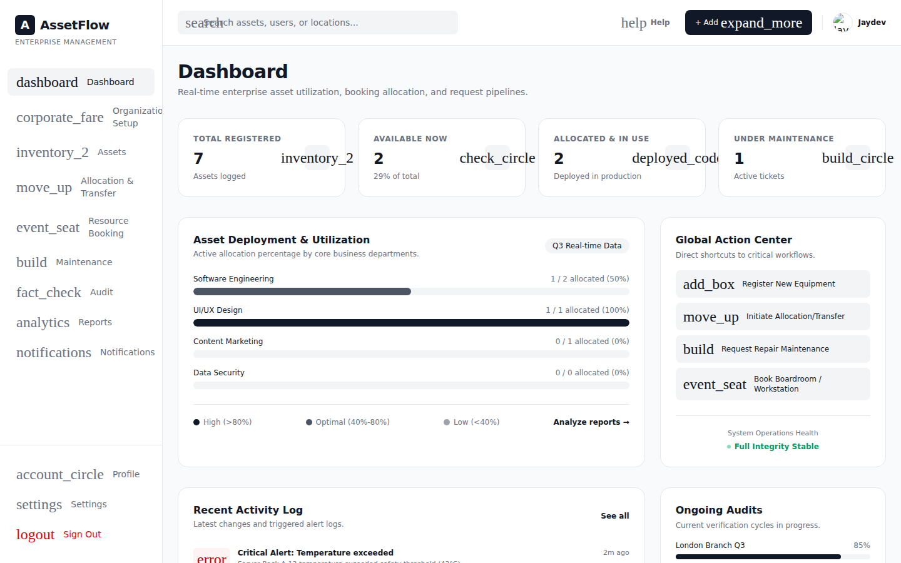
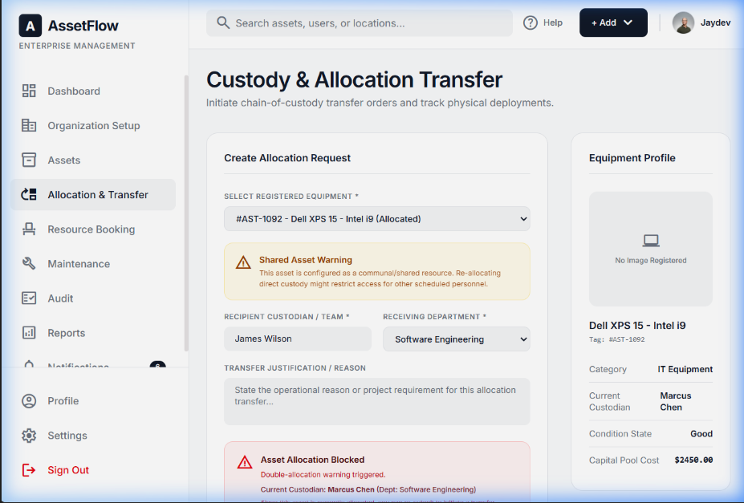
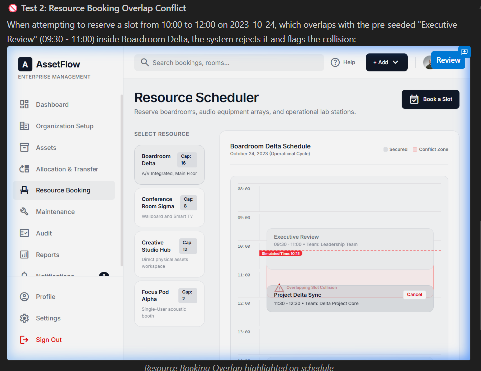
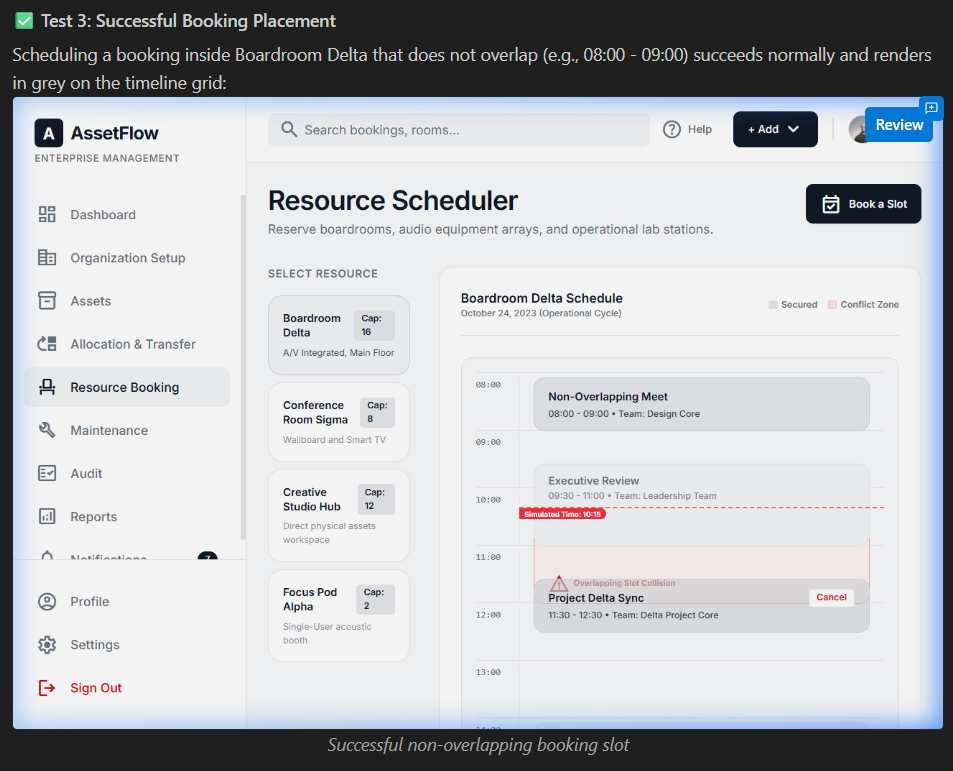
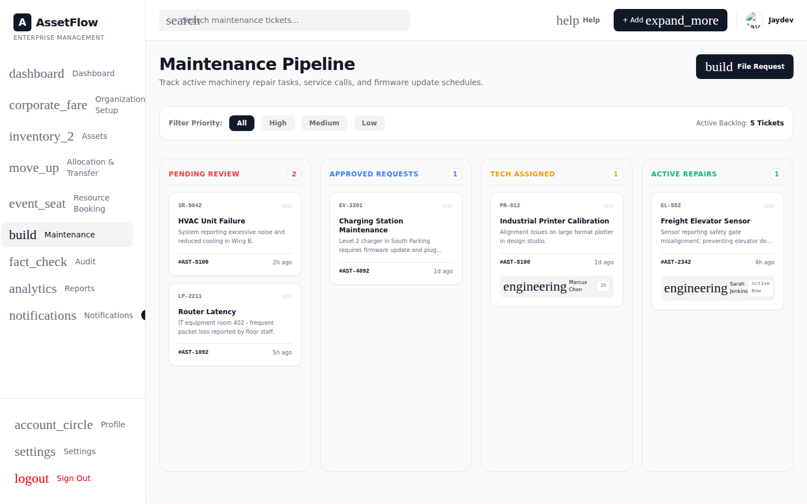
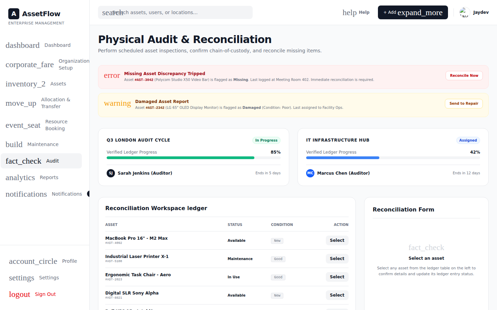

# AssetFlow — Enterprise Asset & Resource Management System

AssetFlow is a centralized ERP-style platform for tracking, allocating, and maintaining an organization's physical assets and shared resources — replacing spreadsheets and paper logs with structured lifecycles, conflict-free booking, and real-time visibility into who holds what, where it is, and its condition.

Built for **Odoo Hackathon 2026 — 8-hour build**.

Not tied to any single industry — any organization with equipment, furniture, vehicles, or shared spaces (offices, schools, hospitals, factories) can use it.

---

## 🚀 What It Does

- **Asset lifecycle tracking** — Available → Allocated → Reserved → Under Maintenance → Lost / Retired / Disposed
- **Allocation with conflict prevention** — the system blocks double-allocating an asset that's already held by someone else, and offers a Transfer Request instead
- **Resource booking with overlap validation** — shared resources (rooms, vehicles, equipment) can't be double-booked for overlapping time slots
- **Maintenance approval workflow** — Pending → Approved → Technician Assigned → In Progress → Resolved, with the asset's status auto-syncing at each stage
- **Structured audit cycles** — assign auditors, verify assets as Verified / Missing / Damaged, auto-generate discrepancy reports, and close the cycle
- **Real-time dashboard & notifications** — KPIs, overdue-return alerts, and a full activity log across the org

---

## 📸 Screenshots

| Login | Dashboard |
|---|---|
|  |  |

| Double-Allocation Block | Booking Conflict |
|---|---|
|  |  |

| Booking Success | Maintenance Workflow |
|---|---|
|  |  |

**Audit Cycle:**



---

## 🧱 Architecture

The repo is split into two independent apps — no shared build tooling, so each can be run and deployed on its own.

```
assetflow-erp/
├── frontend/     React 19 + TypeScript + Vite + Tailwind CSS
└── backend/      Node.js + Express + TypeScript
```

**Frontend** — component-based UI (10 core screens: Dashboard, Organization Setup, Assets, Allocation & Transfer, Resource Booking, Maintenance, Audit, Reports, Notifications, Login), talks to the backend over REST.

**Backend** — Express REST API with an **in-memory data store**, backed by a JSON file (`db.json`) that's written on every mutation and reloaded on server restart — so there's no database dependency, but state still survives a server restart during a demo. Business rules (double-allocation blocking, time-slot overlap detection, maintenance status-sync) are enforced server-side, not just in the UI.

---

## 🔑 Core Business Rules (enforced on the backend, not just the UI)

| Rule | Behavior |
|---|---|
| **Double-allocation block** | `POST /api/allocations` rejects with `409` if the asset isn't `Available`, returning the current holder's name and department |
| **Booking overlap validation** | `POST /api/bookings` rejects with `409` if the requested time slot overlaps an existing booking for the same resource, using interval math (`start1 < end2 && end1 > start2`) |
| **Maintenance status-sync** | Approving a maintenance ticket sets the linked asset to `Under Maintenance`; resolving it sets it back to `Available` |
| **Audit closure** | Closing an audit cycle locks it and updates asset statuses (e.g. confirmed-missing → `Lost`) |

---

## 🛠 Tech Stack

**Frontend:** React 19, TypeScript, Vite, Tailwind CSS
**Backend:** Node.js, Express, TypeScript
**Persistence:** In-memory store + JSON file snapshot (no database required)
**Design:** UI generated via Google Stitch, prototyped in Google AI Studio

---

## ▶️ Running Locally

### Backend
```bash
cd backend
npm install
npm run dev
```
Runs on `http://localhost:5000`.

### Frontend
```bash
cd frontend
npm install
npm run dev
```
Runs on `http://localhost:5173` (or whichever port Vite assigns) and connects to the backend API automatically.

> Both servers need to be running simultaneously for the app to work end-to-end.

### Resetting demo data
```bash
POST http://localhost:5000/api/admin/reset
```
Restores the original seed data — including the pre-configured "already allocated" asset and "already booked" resource used to demo the conflict-blocking rules.

---

## 👥 User Roles

| Role | Capabilities |
|---|---|
| **Admin** | Manages departments, categories, and role assignments; views org-wide analytics |
| **Asset Manager** | Registers/allocates assets; approves transfers, maintenance, and audit resolutions |
| **Department Head** | Views and manages department-scoped assets; approves department requests |
| **Employee** | Views their own assets; books resources; raises maintenance requests |

Sign-up always creates a plain **Employee** account — only an Admin can promote someone to Department Head or Asset Manager, via the Employee Directory.

---

## 📋 Out of Scope

Per the original problem statement, AssetFlow deliberately does **not** handle purchasing, invoicing, or accounting — it's focused purely on asset lifecycle and resource-booking operations.

---

## 🧪 Verified Functionality

Both the backend business rules and the frontend-to-backend wiring have been tested end-to-end:
- Automated backend test suite (`test_api.js`) covering allocation conflicts, booking overlaps, maintenance status-sync, and admin reset
- Manual browser verification of all core flows, including persistence across page refresh (confirming real API calls, not just local state)

---

## 📌 Team

- Jaydev Prajapati
- Shivansh Darji
- Vivek Lad
- Naiteek Choksi